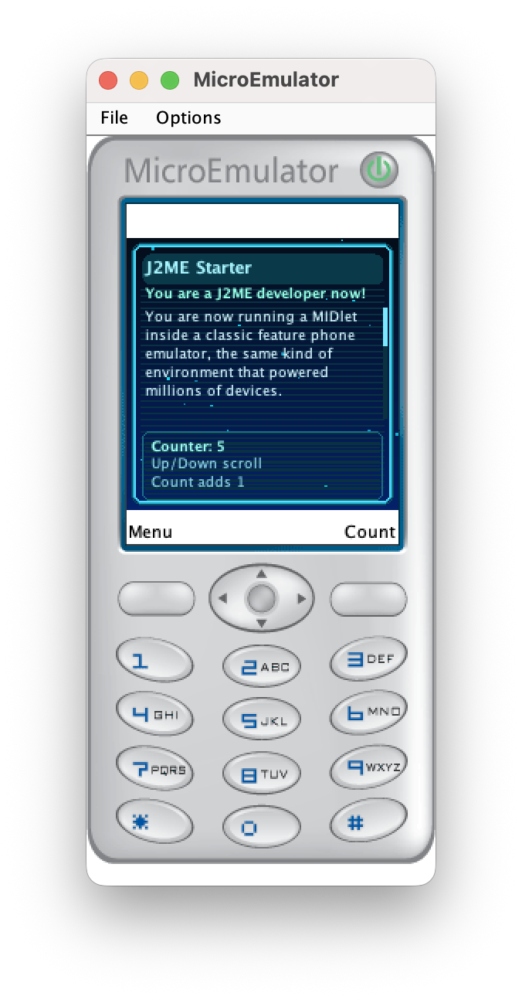

# AbhyasKanaujia/j2me-boilerplate

A forkable J2ME starter kit. Clone it, run it, and start editing in minutes.

Built from the forkable starter: `AbhyasKanaujia/j2me-boilerplate`

## Design Goals

- Explicit requirements: fail fast with actionable errors
- Minimal automation: only automate project-local dependencies
- Deterministic setup: pinned tool versions and a single emulator path

## Prerequisites

Install these before running `make setup`:

- `java`, `javac`, `jar` (JDK required, recommended: Temurin/OpenJDK 17)
- `curl`
- `unzip`

Detailed Java install instructions:

- `docs/java-setup.md`

Quick check:

```bash
java -version
javac -version
jar --help >/dev/null
curl --version
unzip -v
```

## Quick Start

```bash
git clone https://github.com/AbhyasKanaujia/j2me-boilerplate.git
cd j2me-boilerplate
make setup
make run
```

## Start Here

1. Clone the upstream repo if you just want to try the starter.

```bash
git clone https://github.com/AbhyasKanaujia/j2me-boilerplate.git
cd j2me-boilerplate
make setup
make run
```

1. Fork the repo on GitHub when you want your own project history.
2. Clone your fork and start editing these files:
   - `src/MainMIDlet.java` for app UI and interaction logic
   - `app.jad` for app name/version/vendor metadata
   - `Makefile` only if you want to change build behavior

### First Customization Checklist

- Rename metadata values in `app.jad`.
- Replace welcome text and commands in `src/MainMIDlet.java`.
- Run `make run` and confirm your updated MIDlet launches.

## Commands

```bash
make help   # command list
make setup  # install pinned project toolchain
make build  # compile -> preverify -> package
make run    # build and run in MicroEmulator
make doctor # show prerequisites and toolchain status
make clean  # remove generated artifacts
```

## Toolchain (Pinned)

- Eclipse ECJ `3.38.0`
- CLDC API stubs `2.0.4`
- MIDP API stubs `2.0.4`
- ProGuard `7.8.2` (`-microedition` preverification)
- MicroEmulator Swing `2.0.0`

## Build Pipeline

1. `compile` compiles MIDlet sources against CLDC/MIDP stubs
2. `preverify` runs ProGuard in microedition mode
3. `jar` writes `dist/app.jar` and updates JAD fields
4. `run` launches MicroEmulator with `app.jad`

## Screenshot


